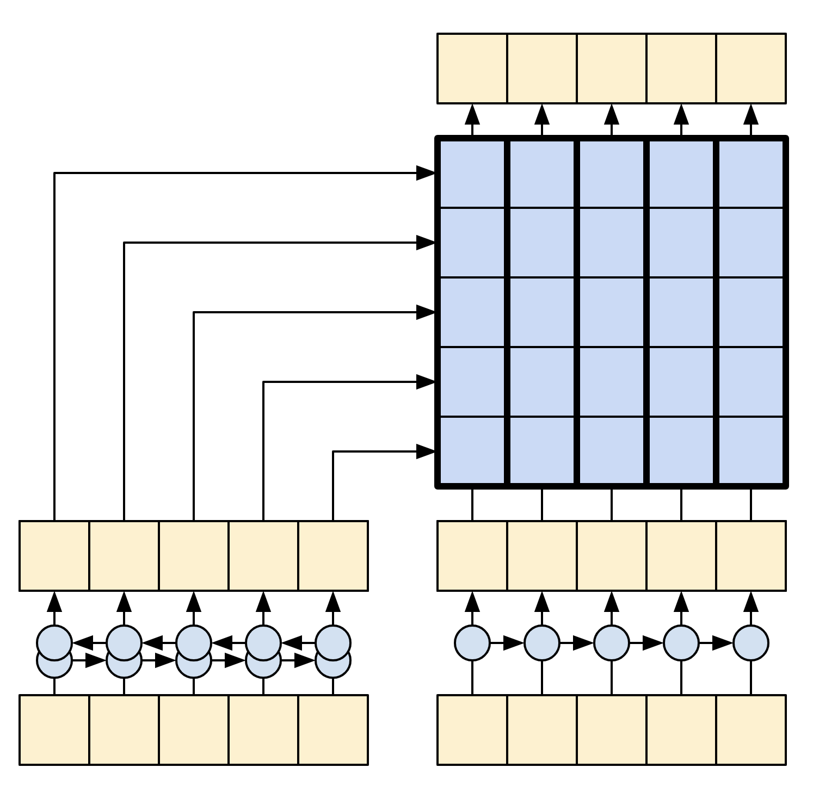
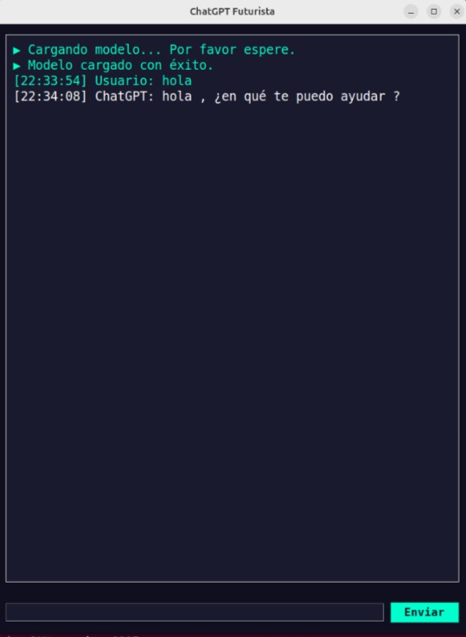

# Chat

Este chat utiliza un modelo de aprendizaje profundo basado en una arquitectura **Seq2Seq** con **codificador**, **decodificador** y una **capa de atención**, capaz de procesar entradas en **español** e **inglés** para generar respuestas contextuales. Además, permite la creación de **algoritmos sencillos** en **Python** y **JavaScript**.

# Dependencias

```bash
!pip install "tensorflow-text==2.15.0"
!pip install einops
```
# Manual Técnico

## Modelo

Este Manual utiliza muchas API de bajo nivel, donde es fácil cometer errores con las dimensiones. Esta clase se utiliza para verificar las dimensiones a lo largo del manual

```python
class ShapeChecker():
    def __init__(self):
        self.shapes = {}

    def __call__(self, tensor, names, broadcast=False):
        if not tf.executing_eagerly():
            return
        parsed = einops.parse_shape(tensor, names)
        for name, new_dim in parsed.items():
            old_dim = self.shapes.get(name, None)
            if (broadcast and new_dim == 1):
                continue
            if old_dim is None:
                self.shapes[name] = new_dim
                continue
            if new_dim != old_dim:
                raise ValueError(
                    f"Shape mismatch for dimension: '{name}'\n"
                    f"    found: {new_dim}\n"
                    f"    expected: {old_dim}\n"
                )
```
### Data

El conjunto de datos utilizado para entrenar este modelo está diseñado para generar funciones de programación a partir de descripciones y contextos

Instancia del conjunto de datos:
```js
{
    "titles": [
            "¿Cómo convertir un entero a una cadena?",
            "Convertir int a string",
            "Entero a texto"
    ],
    "model": "Básico",
    "language": "Python",
    "function_name": "convertir_int_a_string",
    "function_code": "def convertir_int_a_string(numero):\n    return str(numero)",
    "description": "Convierte un número entero a una representación en cadena."
}
```

El modelo se entrena para usar el **contexto** proporcionado en los **titles** como entrada y generar el código objetivo en la sección **function_code**.

### Preparar el Dataset

Esta función, **tf_lower_and_split_punct**, normaliza un texto de entrada en varias etapas:

* **Normalización Unicode**: Convierte caracteres a una representación estándar eliminando marcas de combinación (\p{Mn}).
* **Conversión a minúsculas**: Transforma todo el texto a minúsculas para uniformidad.
* **Filtrado de caracteres**: Conserva solo los caracteres válidos, eliminando los no deseados.
* **Separación de puntuación**: Agrega espacios alrededor de la puntuación y caracteres especiales para facilitar el análisis posterior.
* **Eliminación de espacios innecesarios**: Limpia los espacios adicionales del texto.
* **Añadir tokens especiales**: Inserta [START] al inicio y [END] al final para marcar los límites del texto procesado

```python
def tf_lower_and_split_punct(text):
    # Normalización con unicodedata (equivalente a 'NFKD' de tf_text.normalize_utf8)
    text = tf.strings.regex_replace(
        tf.strings.unicode_transcode(text, input_encoding="UTF-8", output_encoding="UTF-8"),
        "(\p{Mn})", ""
    )
    text = tf.strings.lower(text)
    # Mantener todos los caracteres
    text = tf.strings.regex_replace(text, '[^\\s\\S]', '')
    # Agregar espacios alrededor de la puntuación y caracteres especiales
    text = tf.strings.regex_replace(text, '([.?!,:;(){}\\[\\]\n*+=<>|&^%$#@!~`\'\"\\\\/-])', r' \1 ')
    # Quitar espacios innecesarios
    text = tf.strings.strip(text)
    # Añadir tokens especiales al inicio y al final
    text = tf.strings.join(['[START]', text, '[END]'], separator=' ')
    return text
```

### Procesar el dataset
La función process_text que se muestra a continuación convierte los conjuntos de datos de cadenas en tensores de IDs de tokens con relleno (padding) de ceros. Además, transforma un par (contexto, objetivo) en un par ((contexto, objetivo_entrada), objetivo_salida) para el entrenamiento con keras.Model.fit.

Keras espera pares de (entradas, etiquetas), donde las entradas son (contexto, objetivo_entrada) y las etiquetas son objetivo_salida. La diferencia entre objetivo_entrada y objetivo_salida es que están desplazados en un paso relativo entre sí, de manera que en cada posición, la etiqueta es el siguiente token

```python
def process_text(context, target):
  context = context_text_processor(context).to_tensor()
  target = target_text_processor(target)
  targ_in = target[:,:-1].to_tensor()
  targ_out = target[:,1:].to_tensor()
  return (context, targ_in), targ_out


train_ds = train_raw.map(process_text, tf.data.AUTOTUNE)
val_ds = val_raw.map(process_text, tf.data.AUTOTUNE)
```

### The encoder/decoder


Los siguientes diagramas muestran una vista general del modelo. En ambos, el codificador está a la izquierda y el decodificador a la derecha. En cada paso de tiempo, la salida del decodificador se combina con la salida del codificador para predecir la siguiente palabra.

El modelo original (imagen superior) contiene algunas conexiones adicionales que se omiten intencionalmente en el modelo de este tutorial (imagen inferior), ya que generalmente son innecesarias y difíciles de implementar. Las conexiones omitidas son:

Pasar el estado de la RNN del codificador a la RNN del decodificador.
Retroalimentar la salida de atención a la entrada de la RNN




* **The Encoder**: El objetivo del codificador es procesar la secuencia de contexto en una secuencia de vectores útiles para el decodificador, mientras este intenta predecir la siguiente salida en cada paso de tiempo. Dado que la secuencia de contexto es constante, no hay restricciones sobre cómo puede fluir la información en el codificador, por lo que se utiliza una RNN bidireccional para realizar el procesamiento


    The encoder:

    * Recibe una lista de IDs de tokens (provenientes de context_text_processor).
    * Busca un vector de incrustación para cada token (usando una capa layers.Embedding).
    * Procesa las incrustaciones en una nueva secuencia (utilizando una capa layers.GRU bidireccional).
    * Devuelve la secuencia procesada, que se pasará al mecanismo de atención.

    ```python
    class Encoder(tf.keras.layers.Layer):
        def __init__(self, text_processor, units):
            super(Encoder, self).__init__()
            self.text_processor = text_processor
            self.vocab_size = text_processor.vocabulary_size()
            self.units = units
            
            # The embedding layer converts tokens to vectors
            self.embedding = tf.keras.layers.Embedding(self.vocab_size, units,
                                                    mask_zero=True)

            # The RNN layer processes those vectors sequentially.
            self.rnn = tf.keras.layers.Bidirectional(
                merge_mode='sum',
                layer=tf.keras.layers.GRU(units,
                                    # Return the sequence and state
                                    return_sequences=True,
                                    recurrent_initializer='glorot_uniform'))

        def call(self, x):
            shape_checker = ShapeChecker()
            shape_checker(x, 'batch s')

            # 2. The embedding layer looks up the embedding vector for each token.
            x = self.embedding(x)
            shape_checker(x, 'batch s units')

            # 3. The GRU processes the sequence of embeddings.
            x = self.rnn(x)
            shape_checker(x, 'batch s units')

            # 4. Returns the new sequence of embeddings.
            return x

        def convert_input(self, texts):
            texts = tf.convert_to_tensor(texts)
            if len(texts.shape) == 0:
            texts = tf.convert_to_tensor(texts)[tf.newaxis]
            context = self.text_processor(texts).to_tensor()
            context = self(context)
            return context
    ```

### The Attention Layer


La capa de atención permite que el decodificador acceda a la información extraída por el codificador. Calcula un vector a partir de toda la secuencia de contexto y lo añade a la salida del decodificador.

La forma más simple de calcular un único vector a partir de toda la secuencia sería tomar el promedio a lo largo de la secuencia (usando layers.GlobalAveragePooling1D). Una capa de atención es similar, pero calcula un promedio ponderado de la secuencia de contexto, donde los pesos se calculan combinando los vectores de contexto y de "consulta" (query)

```python
class CrossAttention(tf.keras.layers.Layer):
  def __init__(self, units, **kwargs):
    super().__init__()
    self.mha = tf.keras.layers.MultiHeadAttention(key_dim=units, num_heads=1, **kwargs)
    self.layernorm = tf.keras.layers.LayerNormalization()
    self.add = tf.keras.layers.Add()

  def call(self, x, context):
    shape_checker = ShapeChecker()
 
    shape_checker(x, 'batch t units')
    shape_checker(context, 'batch s units')

    attn_output, attn_scores = self.mha(
        query=x,
        value=context,
        return_attention_scores=True)
    
    shape_checker(x, 'batch t units')
    shape_checker(attn_scores, 'batch heads t s')
    
    # Cache the attention scores for plotting later.
    attn_scores = tf.reduce_mean(attn_scores, axis=1)
    shape_checker(attn_scores, 'batch t s')
    self.last_attention_weights = attn_scores

    x = self.add([x, attn_output])
    x = self.layernorm(x)

    return x
```

### The Decoder


El trabajo del decodificador es generar predicciones para el siguiente token en cada posición de la secuencia objetivo.

Busca las incrustaciones para cada token en la secuencia objetivo.
Utiliza una RNN para procesar la secuencia objetivo y llevar un registro de lo que ha generado hasta el momento.
Usa la salida de la RNN como la "consulta" (query) para la capa de atención al atender la salida del codificador.
En cada posición de la salida, predice el siguiente token.
Durante el entrenamiento, el modelo predice la siguiente palabra en cada posición. Por lo tanto, es crucial que la información fluya en una sola dirección a través del modelo. El decodificador utiliza una RNN unidireccional (no bidireccional) para procesar la secuencia objetivo.

Al ejecutar inferencias con este modelo, genera una palabra a la vez, y estas palabras se retroalimentan en el modelo.

```python
class Decoder(tf.keras.layers.Layer):
  @classmethod
  def add_method(cls, fun):
    setattr(cls, fun.__name__, fun)
    return fun

  def __init__(self, text_processor, units):
    super(Decoder, self).__init__()
    self.text_processor = text_processor
    self.vocab_size = text_processor.vocabulary_size()
    self.word_to_id = tf.keras.layers.StringLookup(
        vocabulary=text_processor.get_vocabulary(),
        mask_token='', oov_token='[UNK]')
    self.id_to_word = tf.keras.layers.StringLookup(
        vocabulary=text_processor.get_vocabulary(),
        mask_token='', oov_token='[UNK]',
        invert=True)
    self.start_token = self.word_to_id('[START]')
    self.end_token = self.word_to_id('[END]')

    self.units = units


    # 1. The embedding layer converts token IDs to vectors
    self.embedding = tf.keras.layers.Embedding(self.vocab_size,
                                               units, mask_zero=True)

    # 2. The RNN keeps track of what's been generated so far.
    self.rnn = tf.keras.layers.GRU(units,
                                   return_sequences=True,
                                   return_state=True,
                                   recurrent_initializer='glorot_uniform')

    # 3. The RNN output will be the query for the attention layer.
    self.attention = CrossAttention(units)

    # 4. This fully connected layer produces the logits for each
    # output token.
    self.output_layer = tf.keras.layers.Dense(self.vocab_size)
```

### Entrenamiento

A continuación, el método call recibe tres argumentos:

* inputs: Un par compuesto por context y x, donde:

    * context: Es el contexto proveniente de la salida del codificador.
    * x: Es la secuencia objetivo de entrada.
* state: Opcional, el estado anterior producido por el decodificador (el estado interno de la RNN del decodificador). Se pasa el estado de una ejecución previa para continuar generando texto desde donde se dejó.

* return_state: [Por defecto: False] Configura esto en True para devolver el estado de la RNN.

```python
@Decoder.add_method
def call(self,
         context, x,
         state=None,
         return_state=False):  
  shape_checker = ShapeChecker()
  shape_checker(x, 'batch t')
  shape_checker(context, 'batch s units')

  # 1. Lookup the embeddings
  x = self.embedding(x)
  shape_checker(x, 'batch t units')

  # 2. Process the target sequence.
  x, state = self.rnn(x, initial_state=state)
  shape_checker(x, 'batch t units')

  # 3. Use the RNN output as the query for the attention over the context.
  x = self.attention(x, context)
  self.last_attention_weights = self.attention.last_attention_weights
  shape_checker(x, 'batch t units')
  shape_checker(self.last_attention_weights, 'batch t s')

  # Step 4. Generate logit predictions for the next token.
  logits = self.output_layer(x)
  shape_checker(logits, 'batch t target_vocab_size')

  if return_state:
    return logits, state
  else:
    return logits
```

Inferencia

Para usarlo en inferencia, son necesarios estos métodos adicionales

```python
@Decoder.add_method
def get_initial_state(self, context):
  batch_size = tf.shape(context)[0]
  start_tokens = tf.fill([batch_size, 1], self.start_token)
  done = tf.zeros([batch_size, 1], dtype=tf.bool)
  embedded = self.embedding(start_tokens)
  return start_tokens, done, self.rnn.get_initial_state(embedded)[0]
```
```python
@Decoder.add_method
def tokens_to_text(self, tokens):
  words = self.id_to_word(tokens)
  result = tf.strings.reduce_join(words, axis=-1, separator=' ')
  result = tf.strings.regex_replace(result, '^ *\[START\] *', '')
  result = tf.strings.regex_replace(result, ' *\[END\] *$', '')
  return result
```
```python
@Decoder.add_method
def get_next_token(self, context, next_token, done, state, temperature = 0.0):
  logits, state = self(
    context, next_token,
    state = state,
    return_state=True) 
  
  if temperature == 0.0:
    next_token = tf.argmax(logits, axis=-1)
  else:
    logits = logits[:, -1, :]/temperature
    next_token = tf.random.categorical(logits, num_samples=1)

  # If a sequence produces an `end_token`, set it `done`
  done = done | (next_token == self.end_token)
  # Once a sequence is done it only produces 0-padding.
  next_token = tf.where(done, tf.constant(0, dtype=tf.int64), next_token)
  
  return next_token, done, state
```

Con esas funciones adicionales, se puede escribir un bucle de generación

```python
# Setup the loop variables.
next_token, done, state = decoder.get_initial_state(ex_context)
tokens = []

for n in range(10):
  # Run one step.
  next_token, done, state = decoder.get_next_token(
      ex_context, next_token, done, state, temperature=1.0)
  # Add the token to the output.
  tokens.append(next_token)

# Stack all the tokens together.
tokens = tf.concat(tokens, axis=-1) # (batch, t)

# Convert the tokens back to a a string
result = decoder.tokens_to_text(tokens)
result[:3].numpy()
```

### El modelo

Ahora que ya se tienen todos los componentes del modelo, se combinan para construir el modelo destinado al entrenamiento:

```python
class Translator(tf.keras.Model):
  @classmethod
  def add_method(cls, fun):
    setattr(cls, fun.__name__, fun)
    return fun

  def __init__(self, units,
               context_text_processor,
               target_text_processor):
    super().__init__()
    # Build the encoder and decoder
    encoder = Encoder(context_text_processor, units)
    decoder = Decoder(target_text_processor, units)

    self.encoder = encoder
    self.decoder = decoder

  def call(self, inputs):
    context, x = inputs
    context = self.encoder(context)
    logits = self.decoder(context, x)

    #TODO(b/250038731): remove this
    try:
      # Delete the keras mask, so keras doesn't scale the loss+accuracy. 
      del logits._keras_mask
    except AttributeError:
      pass

    return logits
```

Configurar el modelo para el entrenamiento:
```python
model.compile(optimizer='adam',
              loss=masked_loss, 
              metrics=[masked_acc, masked_loss])
```
Entrenar
```python
history = model.fit(
    train_ds.repeat(), 
    epochs=100,
    steps_per_epoch = 100,
    validation_data=val_ds,
    validation_steps = 20,
    callbacks=[
        tf.keras.callbacks.EarlyStopping(patience=3)])
```

Ahora que el modelo está entrenado, se implementa una función para ejecutar la generación completa de texto => texto. Este código es básicamente idéntico al ejemplo de inferencia en la sección del decodificador, pero también captura los pesos de atención

```python
#@title
@Translator.add_method
def translate(self,
              texts, *,
              max_length=50,
              temperature=0.0):
  # Process the input texts
  context = self.encoder.convert_input(texts)
  batch_size = tf.shape(texts)[0]

  # Setup the loop inputs
  tokens = []
  attention_weights = []
  next_token, done, state = self.decoder.get_initial_state(context)

  for _ in range(max_length):
    # Generate the next token
    next_token, done, state = self.decoder.get_next_token(
        context, next_token, done,  state, temperature)
        
    # Collect the generated tokens
    tokens.append(next_token)
    attention_weights.append(self.decoder.last_attention_weights)
    
    if tf.executing_eagerly() and tf.reduce_all(done):
      break

  # Stack the lists of tokens and attention weights.
  tokens = tf.concat(tokens, axis=-1)   # t*[(batch 1)] -> (batch, t)
  self.last_attention_weights = tf.concat(attention_weights, axis=1)  # t*[(batch 1 s)] -> (batch, t s)

  result = self.decoder.tokens_to_text(tokens)
  return result
```

### Exportar Modelo

Si se desea exportar este modelo, se necesitara envolver el método de traducción en un tf.function. Esa implementación cumplirá con el objetivo

```python
class Export(tf.Module):
  def __init__(self, model):
    self.model = model

  @tf.function(input_signature=[tf.TensorSpec(dtype=tf.string, shape=[None])])
  def translate(self, inputs):
    return self.model.translate(inputs)
```

```python
export = Export(model)
```

Es necesario ejecutar el **tf.function** una vez para compilarlo
```python
_ = export.translate(tf.constant(inputs))
```
```python
result = export.translate(tf.constant(inputs))

print(result[0].numpy().decode())
print(result[1].numpy().decode())
print(result[2].numpy().decode())
print()
```

Ahora que la función ha sido rastreada, se puede exportar utilizando saved_model.save

```python
tf.saved_model.save(export, 'translator',
                    signatures={'serving_default': export.translate})
```

## GUI
La interfaz gráfica de usuario (GUI) es un entorno amigable e interactivo diseñado para facilitar la comunicación entre el usuario y un modelo. Desarrollada con **Tkinter**, la GUI presenta un diseño limpio y funcional.

Esta función carga el modelo
```python
# Función para cargar el modelo
def cargar_modelo(messages_list):
    global reloaded
    try:
        messages_list.configure(state=tk.NORMAL)
        messages_list.insert(tk.END, "\u25b6 Cargando modelo... Por favor espere.\n", "bot")
        messages_list.configure(state=tk.DISABLED)
        messages_list.update()

        # Simular tiempo de carga del modelo
        reloaded = tf.saved_model.load(model_path)

        messages_list.configure(state=tk.NORMAL)
        messages_list.insert(tk.END, "\u25b6 Modelo cargado con éxito.\n", "bot")
        messages_list.configure(state=tk.DISABLED)
    except Exception as e:
        messagebox.showerror("Error", f"Error cargando el modelo: {e}")
```

El código define la función **main_window()**, que crea la ventana principal de una interfaz gráfica de usuario

1. Configuración de la Ventana Principal

    ```python
    root = tk.Tk()
    root.title("ChatGPT Futurista")
    root.geometry("700x900")
    root.configure(bg="#0f0f1f")
    ```
2. Estilos Personalizados

    ```python
    style = ttk.Style()
    style.configure("TFrame", background="#0f0f1f")
    style.configure("TLabel", background="#0f0f1f", foreground="#00ffcc", font=("Consolas", 12))
    style.configure("TButton", background="#00ffcc", foreground="#0f0f1f", font=("Consolas", 12, "bold"))
    style.map("TButton", background=[("active", "#005f5f")])
    ```
3. Sección de mensajes
    ```python
    messages_frame = ttk.Frame(root, style="TFrame")
    messages_frame.pack(fill=tk.BOTH, expand=True, padx=10, pady=10)

    messages_list = tk.Text(messages_frame, wrap=tk.WORD, state=tk.DISABLED, bg="#1a1a2e", fg="#00ffcc",
                            insertbackground="#00ffcc", font=("Consolas", 14), relief=tk.FLAT, borderwidth=0, padx=10, pady=10)
    messages_list.pack(fill=tk.BOTH, expand=True, padx=5, pady=5)
    ```
4. Entrada de Texto
    ```python
    entry_frame = ttk.Frame(root, style="TFrame")
    entry_frame.pack(fill=tk.X, padx=10, pady=10)

    text_entry = ttk.Entry(entry_frame, font=("Consolas", 14), style="TEntry")
    text_entry.pack(side=tk.LEFT, fill=tk.X, expand=True, padx=5, pady=5)

    send_button = ttk.Button(entry_frame, text="Enviar", command=lambda: send_message(messages_list, text_entry))
    send_button.pack(side=tk.RIGHT, padx=5, pady=5)
    ```
5. Personalización del Campo de Entrada
    ```python
    style.configure("TEntry", fieldbackground="#1a1a2e", foreground="#00ffcc", relief="flat")
    ```
6. Cargar Modelo en un Hilo Separado
    ```python
    threading.Thread(target=cargar_modelo, args=(messages_list,)).start()
    ```
7. Iniciar el Bucle Principal
    ```python
    root.mainloop()
    ```

El código define dos funciones: **send_message** y **add_message**, que juntas manejan la interacción del usuario con el **chatbot** y la presentación de los mensajes en la interfaz gráfica.

#### Función send_message
Esta función se ejecuta cuando el usuario envía un mensaje. Sus pasos principales son

1. Obtener el Mensaje del Usuario
    ```python
    user_message = text_entry.get()
    if not user_message:
        messagebox.showwarning("Advertencia", "Por favor, ingrese un mensaje.")
        return
    ```
2. Mostrar el Mensaje del Usuario
    ```python
    add_message(messages_list, "Usuario", user_message, "#00ffcc")
    ```
3. Generar Respuesta del Chatbot
    ```python
    try:
        inputs = [user_message]
        result = reloaded.translate(tf.constant(inputs))
        bot_response = result[0].numpy().decode()
    except Exception as e:
        bot_response = f"Error: {e}"
    ```
4. Mostrar la Respuesta del Chatbot
    ```python
    add_message(messages_list, "ChatGPT", bot_response, "#ffffff")
    ```
5. Limpiar el Campo de Entrada
    ```python
    text_entry.delete(0, tk.END)
    ```
#### Función add_message
Esta función agrega un mensaje al área de texto (messages_list).

1. Habilitar Edición Temporal
    ```python
    messages_list.configure(state=tk.NORMAL)
    ```
2. Formatear y Agregar el Mensaje
    ```python
    timestamp = datetime.now().strftime('%H:%M:%S')
    messages_list.insert(tk.END, f"[{timestamp}] {sender}: {message}\n", (sender,))
    ```
3. Aplicar Estilo al Mensaje
    ```python
    messages_list.tag_config(sender, foreground=color)
    ```
4. Deshabilitar Edición y Mostrar el Último Mensaje
    ```python
    messages_list.configure(state=tk.DISABLED)
    messages_list.see(tk.END)
    ```
# Manual de Usuario
**"ChatGPT Futurista"** es una aplicación basada en inteligencia artificial que permite a los usuarios interactuar con un modelo de lenguaje avanzado en tiempo real. Diseñada con una interfaz gráfica amigable y minimalista.



Este manual incluye:

* Descripción de los componentes de la interfaz.

* Guía paso a paso para usar el chat.

## Guía de Uso

### Paso 1: Abrir la Aplicación

Al iniciar "ChatGPT Futurista", la ventana principal se abrirá automáticamente y mostrará los mensajes de estado mientras se carga el modelo.

### Paso 2: Escribir un Mensaje

Escribe tu mensaje en el campo de entrada de texto ubicado en la parte inferior de la ventana.

Ejemplo: "hola"

### Paso 3: Enviar el Mensaje

Haz clic en el botón Enviar o presiona la tecla Enter para enviar tu mensaje.

### Paso 4: Leer la Respuesta

La respuesta del chatbot aparecerá en el área de mensajes con un formato claro:

[Hora del mensaje] Usuario: Indica el mensaje enviado por ti.

[Hora del mensaje] ChatGPT: Muestra la respuesta del bot.

### Paso 5: Interactuar

Continúa escribiendo mensajes y leyendo las respuestas para interactuar con el chatbot.