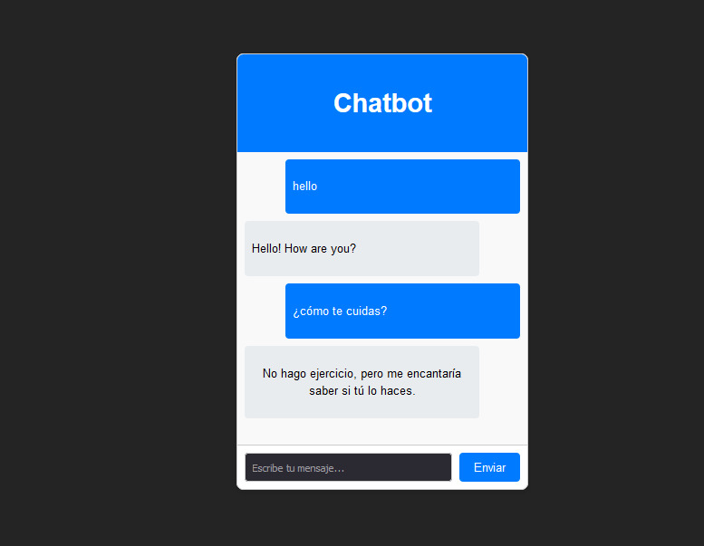

# Chatbot

El proyecto consiste en un chatbot que utiliza el modelo Universal Sentence Encoder (USE) de TensorFlow.js para comprender y procesar el lenguaje natural en tiempo real. La interfaz de usuario está desarrollada con React y potenciada por Vite, logrando una aplicación web moderna, rápida y altamente interactiva.

## Manual Técnico

### Dependencias

* **@tensorflow/tfjs**: biblioteca TensorFlow.js para aprendizaje automático

* **@tensorflow-models/universal-sentence-encoder**: Codifica texto en incorporaciones para tareas en PLN.

```bash
npm install @tensorflow/tfjs @tensorflow-models/universal-sentence-encoder
```

### Intents


Los intents (intenciones) son un concepto clave en el desarrollo de chatbots y sistemas de procesamiento de lenguaje natural. Representan las intenciones o propósitos detrás de los mensajes de los usuarios

```json
const intents = {
  firmativo: [
    "si",
    "correcto",
    "afirmativo",
    "asi es",
    "yes",
    "esta bien",
    "sii",
    "tienes razon",
    "me parece bien",
    "eso es correcto",
    "es verdad",
    "cierto",
    "bien",
    "estoy de acuerdo",
  ],
  cuentaChiste: [
    "hey",
    "hola",
    "oye",
    "me puedes contar un chiste",
    "un chiste",
    "algo gracioso",
    "un chiste que quiero reir",
    "animame",
    "un chistecito",
    "chistes para reirme",
    "bromas",
    "chistes",
    "cosas graciosas",
    "me puedes contar",
    "cuentame",
    "cuentate",
    "comparte",
    "quiero que me cuentes",
    "deseo que me cuentes",
    "cuenta",
    "matame de risa con",
    "sabes",
    "quiero reir",
    "por favor",
  ]
}
```

## Responses 

Las responses (respuestas) son las acciones o mensajes que el chatbot devuelve al usuario después de identificar un intent. Representan la forma en que el chatbot responde a las necesidades del usuario, proporcionando información, haciendo preguntas adicionales, o ejecutando acciones específicas.


```json
const responses = {
  greeting: "¡Hola! ¿Cómo puedo ayudarte hoy?",
  goodbye: "¡Adiós! ¡Que tengas un gran día!",
  thanks: "¡De nada! Si tienes alguna otra pregunta, no dudes en preguntar.",
  product_inquiry:
    "Ofrecemos una variedad de productos, incluyendo electrónicos, libros, ropa y más. ¿En qué categoría estás interesado?",
  order_status:
    "Por favor, proporciona tu ID de pedido y con gusto verificaré el estado para ti.",
  shipping_info:
    "Ofrecemos varios métodos de envío, incluyendo estándar, exprés y entrega al día siguiente. Los tiempos y costos dependen del método elegido y tu ubicación.",
  return_policy:
    "Nuestra política de devoluciones permite devolver productos dentro de los 30 días posteriores a la compra. Visita nuestra página de devoluciones para más detalles.",
  payment_methods:
    "Aceptamos tarjetas de crédito/débito, PayPal y transferencias bancarias. Elige el método que prefieras al finalizar tu compra."
}
```

### Cargar Tensorflow y el modelo Universal Sentence Encoder

```ts
import * as tf from '@tensorflow/tfjs';
import * as use from '@tensorflow-models/universal-sentence-encoder';
import { intents } from './intents';
import { responses } from './responses';

// Cargar el modelo Universal Sentence Encoder
let model;
use.load().then((loadedModel) => {
  model = loadedModel;
  console.log('Model loaded');
});
```

### Implementación del reconocimiento de intenciones
```ts
export async function recognizeIntent(userInput) {
  if (!model) {
    throw new Error('El modelo no está cargado');
  }
  const userInputEmb = await model.embed([userInput]);
  let maxScore = -1;
  let recognizedIntent = null;

  for (const [intent, examples] of Object.entries(intents)) {
    const examplesEmb = await model.embed(examples);
    const scores = await tf.matMul(userInputEmb, examplesEmb, false, true).data();
    const maxExampleScore = Math.max(...scores);
    if (maxExampleScore > maxScore) {
      maxScore = maxExampleScore;
      recognizedIntent = intent;
    }
  }
  return recognizedIntent;
}
```

### Generación de Respuesta
```ts
export async function generateResponse(userInput) {
  if (!model) {
    throw new Error('El modelo no está cargado');
  }
  const intent = await recognizeIntent(userInput);
  if (intent && responses[intent]) {
    return responses[intent];
  } else {
    return "I'm sorry, I don't understand that. Can you please rephrase?";
  }
}
```

### Implementación de la interacción con el chatbot

```ts
import React, { useState, useEffect } from 'react';
import { recognizeIntent, generateResponse } from '../model/model'; // Importa las funciones correctamente
import Message from '../Message/Message'; // Componente para mostrar mensajes
import InputField from '../InputField/InputField'; // Componente para el campo de entrada

const Chatbox = () => {
  const [messages, setMessages] = useState([]);
  const [loading, setLoading] = useState(true);

  useEffect(() => {
    async function loadModel() {
      try {
        await recognizeIntent(''); // Cargar el modelo
        setLoading(false);
        console.log("Modelo cargado y configurado");
      } catch (error) {
        console.error("Error al cargar el modelo:", error);
        setLoading(false);
      }
    }
    loadModel();
  }, []);

  const sendMessage = async (userMessage) => {
    if (!userMessage.trim()) {
      console.error("El mensaje está vacío");
      return;
    }

    // Asegurarse de que userMessage es una cadena de texto
    if (typeof userMessage !== 'string') {
      console.error("El mensaje debe ser una cadena de caracteres");
      return;
    }

    // Agrega el mensaje del usuario al estado de los mensajes
    setMessages((prev) => [...prev, { sender: 'Usuario', text: userMessage }]);
    console.log("Mensaje del usuario enviado:", userMessage);

    // Si el modelo no está listo, muestra un mensaje de espera
    if (loading) {
      console.error("El modelo no está listo");
      setMessages((prev) => [...prev, { sender: 'Bot', text: "Lo siento, el modelo aún no está listo para responder." }]);
      return;
    }

    try {
      console.log("Prediciendo respuesta...");
      // Predice la respuesta utilizando el modelo
      const botResponse = await generateResponse(userMessage);
      setMessages((prev) => [...prev, { sender: 'Bot', text: botResponse }]);
      console.log("Respuesta del bot:", botResponse);
    } catch (error) {
      console.error("Error al predecir la respuesta:", error);
      setMessages((prev) => [...prev, { sender: 'Bot', text: "Hubo un error al procesar tu solicitud." }]);
    }
  };

  return (
    <div className="chatbox-container">
      <div className="chatbox-header">
        <h2>Chatbot</h2>
      </div>
      <div className="chatbox-messages">
        {loading ? (
          <div className="loading">Cargando el modelo... Por favor, espera.</div>
        ) : (
          messages.map((msg, index) => (
            <Message key={index} sender={msg.sender} text={msg.text} />
          ))
        )}
      </div>
      <InputField onSend={sendMessage} />
    </div>
  );
};

export default Chatbox;
```

## Manual de Usuario 

### Interfaz grafica 

Para interactuar con el **chatbot** solo es necesario escribir un mensaje y presionar el botón de **enviar**



