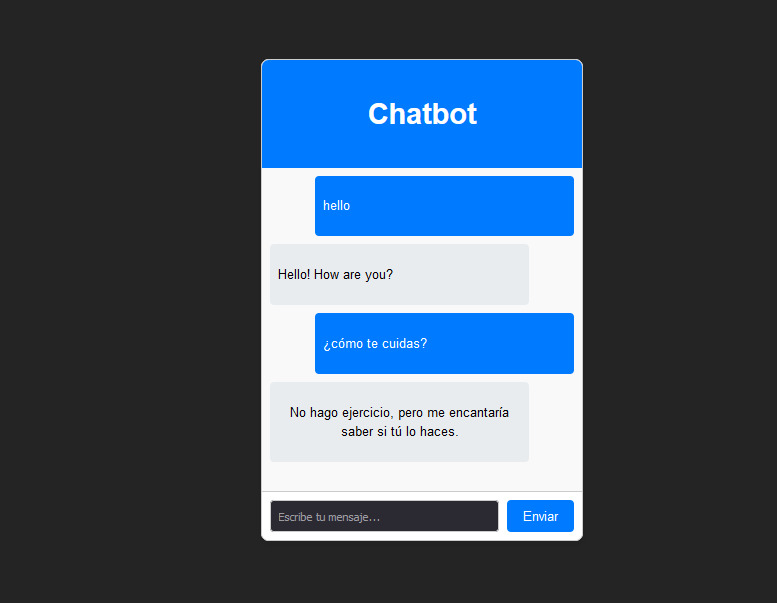

# Chatbot

El proyecto consiste en un chatbot que utiliza el modelo Universal Sentence Encoder (USE) de TensorFlow.js para comprender y procesar el lenguaje natural en tiempo real. Es capaza de comprender tanto **ESPAÑOL** como **INGLES**. La interfaz de usuario está desarrollada con React y potenciada por Vite, logrando una aplicación web moderna, rápida y altamente interactiva.

## Manual Técnico

### Dependencias

* **@tensorflow/tfjs**: biblioteca TensorFlow.js para aprendizaje automático

* **@tensorflow-models/universal-sentence-encoder**: Codifica texto en incorporaciones para tareas en PLN.

```bash
npm install @tensorflow/tfjs @tensorflow-models/universal-sentence-encoder
```

### Intents


Los intents (intenciones) son un concepto clave en el desarrollo de chatbots y sistemas de procesamiento de lenguaje natural. Representan las intenciones o propósitos detrás de los mensajes de los usuarios

#### Itents en Español e Ingles
```JS
export const intents = {
  es: {
    greeting: ['hola', 'buenos días', 'buenas tardes', 'buenas noches', 'qué tal', 'hola, ¿cómo estás?', 'hola, ¿qué tal?', 'hola, ¿cómo va todo?'],
    goodbye: ['adiós', 'hasta luego', 'nos vemos', 'chau', 'hasta la próxima', 'me despido', 'hasta pronto', 'cuídate'],
    thanks: ['gracias', 'muchas gracias', 'te lo agradezco', 'muchísimas gracias', 'mil gracias', 'gracias por tu ayuda', 'gracias por todo'],
    small_talk: ['¿cómo estás?', '¿qué tal?', '¿qué haces?', 'cuéntame algo', '¿cómo va tu día?', '¿qué planes tienes para hoy?', '¿cómo te sientes?', '¿qué hay de nuevo?'],
    hobbies: ['¿cuáles son tus hobbies?', '¿qué te gusta hacer?', '¿tienes algún pasatiempo?', '¿qué haces en tu tiempo libre?', '¿qué te apasiona?', '¿qué actividades disfrutas?', '¿qué te gusta hacer para divertirte?'],
    favorite_food: ['¿cuál es tu comida favorita?', '¿qué te gusta comer?', '¿tienes algún plato favorito?', '¿qué comida prefieres?', '¿cuál es tu postre favorito?', '¿qué tipo de comida te gusta?', '¿te gusta la comida rápida?'],
  },
  en: {
    greeting: ['hello', 'good morning', 'good afternoon', 'good evening', 'how are you', 'hi, how are you?', 'hi there', 'hey, how are you?'],
    goodbye: ['goodbye', 'see you later', 'see you', 'bye', 'until next time', 'take care', 'catch you later', 'farewell'],
    thanks: ['thank you', 'thanks a lot', 'I appreciate it', 'thank you very much', 'many thanks', 'thanks for your help', 'thanks for everything'],
    small_talk: ['how are you?', 'what’s up?', 'what are you doing?', 'tell me something', 'how’s your day going?', 'any plans for today?', 'how do you feel?', 'what’s new?'],
    hobbies: ['what are your hobbies?', 'what do you like to do?', 'do you have any hobbies?', 'what do you do in your free time?', 'what are you passionate about?', 'what activities do you enjoy?', 'what do you like to do for fun?'],
    favorite_food: ['what’s your favorite food?', 'what do you like to eat?', 'do you have a favorite dish?', 'what food do you prefer?', 'what’s your favorite dessert?', 'what kind of food do you like?', 'do you like fast food?'],
  }
};
```

### Responses 

Las responses (respuestas) son las acciones o mensajes que el chatbot devuelve al usuario después de identificar un intent. Representan la forma en que el chatbot responde a las necesidades del usuario, proporcionando información, haciendo preguntas adicionales, o ejecutando acciones específicas.


```js
export const responses = {
  es: {
    greeting: ['¡Hola! ¿Cómo puedo ayudarte hoy?', '¡Hola! ¿En qué puedo asistirte?', '¡Hola! ¿Cómo estás?'],
    goodbye: ['¡Adiós! ¡Que tengas un gran día!', '¡Hasta luego! ¡Cuídate!', '¡Nos vemos! ¡Que estés bien!'],
    thanks: ['¡De nada! Si tienes alguna otra pregunta, no dudes en preguntar.', '¡Con gusto! ¿Necesitas algo más?', '¡De nada! Estoy aquí para ayudarte.'],
    small_talk: ['Estoy bien, gracias por preguntar. ¿Y tú?', 'Todo bien por aquí. ¿Qué tal tú?', 'Estoy aquí para ayudarte. ¿En qué puedo asistirte?', '¡Hola! ¿Cómo va tu día?'],
    hobbies: ['Me gusta aprender cosas nuevas. ¿Y a ti?', 'No tengo hobbies, pero me encantaría saber los tuyos.', 'Me encanta conversar contigo. ¿Cuáles son tus pasatiempos?'],
    favorite_food: ['No tengo una comida favorita, pero me encantaría saber cuál es la tuya.', 'No como, pero me encantaría saber qué te gusta comer.', 'No tengo preferencias, pero me encantaría saber tus gustos.'],
  },
  en: {
    greeting: ['Hello! How can I help you today?', 'Hi there! How can I assist you?', 'Hello! How are you?'],
    goodbye: ['Goodbye! Have a great day!', 'See you later! Take care!', 'Goodbye! Stay safe!'],
    thanks: ['You are welcome! If you have any other questions, feel free to ask.', 'My pleasure! Do you need anything else?', 'You are welcome! I am here to help.'],
    small_talk: ['I am fine, thank you for asking. How about you?', 'All good here. How about you?', 'I am here to help you. How can I assist you?', 'Hello! How is your day going?'],
    hobbies: ['I like learning new things. How about you?', 'I do not have hobbies, but I would love to know yours.', 'I love chatting with you. What are your hobbies?'],
    favorite_food: ['I do not have a favorite food, but I would love to know yours.', 'I do not eat, but I would love to know what you like to eat.', 'I do not have preferences, but I would love to know your tastes.'],
  }
};
```

### Cargar Tensorflow y el modelo Universal Sentence Encoder

Se cargan las bibliotecas necesarias y el modelo del codificador de oraciones universal de forma asincrónica y se inicia el **chatbot** una vez cargado el modelo.

```ts
import * as tf from '@tensorflow/tfjs';
import * as use from '@tensorflow-models/universal-sentence-encoder';
import { intents } from './intents';
import { responses } from './responses';

// Cargar el modelo Universal Sentence Encoder
let model;
use.load().then((loadedModel) => {
  model = loadedModel;
  console.log('Model loaded');
});
```

### Implementación del reconocimiento de intenciones

Agrega una función para reconocer la **intención** de la entrada del usuario. Para ello, incrustamos la entrada del usuario en un vector de alta dimensión utilizando el codificador universal y luego identificamos la puntuación de similitud más alta basada en la intención.

```ts
export async function recognizeIntent(userInput) {
  if (!model) {
    throw new Error('El modelo no está cargado');
  }
  const userInputEmb = await model.embed([userInput]);
  let maxScore = -1;
  let recognizedIntent = null;

  for (const [intent, examples] of Object.entries(intents)) {
    const examplesEmb = await model.embed(examples);
    const scores = await tf.matMul(userInputEmb, examplesEmb, false, true).data();
    const maxExampleScore = Math.max(...scores);
    if (maxExampleScore > maxScore) {
      maxScore = maxExampleScore;
      recognizedIntent = intent;
    }
  }
  return recognizedIntent;
}
```

### Generación de Respuesta


Agrega una función para generar respuestas basadas en la intención reconocida
```ts
export async function generateResponse(userInput) {
  if (!model) {
    throw new Error('El modelo no está cargado');
  }
  const intent = await recognizeIntent(userInput);
  if (intent && responses[intent]) {
    return responses[intent];
  } else {
    return "I'm sorry, I don't understand that. Can you please rephrase?";
  }
}
```

### Implementación de la interacción con el chatbot


Finalmente, implementa el bucle de interacción con el chatbot configurando la interfaz para leer la entrada del usuario desde la línea de comandos, solicitando al usuario su entrada y generando respuestas en consecuencia

```ts
import React, { useState, useEffect } from 'react';
import { recognizeIntent, generateResponse } from '../model/model'; // Importa las funciones correctamente
import Message from '../Message/Message'; // Componente para mostrar mensajes
import InputField from '../InputField/InputField'; // Componente para el campo de entrada

const Chatbox = () => {
  const [messages, setMessages] = useState([]);
  const [loading, setLoading] = useState(true);

  useEffect(() => {
    async function loadModel() {
      try {
        await recognizeIntent(''); // Cargar el modelo
        setLoading(false);
        console.log("Modelo cargado y configurado");
      } catch (error) {
        console.error("Error al cargar el modelo:", error);
        setLoading(false);
      }
    }
    loadModel();
  }, []);

  const sendMessage = async (userMessage) => {
    if (!userMessage.trim()) {
      console.error("El mensaje está vacío");
      return;
    }

    // Asegurarse de que userMessage es una cadena de texto
    if (typeof userMessage !== 'string') {
      console.error("El mensaje debe ser una cadena de caracteres");
      return;
    }

    // Agrega el mensaje del usuario al estado de los mensajes
    setMessages((prev) => [...prev, { sender: 'Usuario', text: userMessage }]);
    console.log("Mensaje del usuario enviado:", userMessage);

    // Si el modelo no está listo, muestra un mensaje de espera
    if (loading) {
      console.error("El modelo no está listo");
      setMessages((prev) => [...prev, { sender: 'Bot', text: "Lo siento, el modelo aún no está listo para responder." }]);
      return;
    }

    try {
      console.log("Prediciendo respuesta...");
      // Predice la respuesta utilizando el modelo
      const botResponse = await generateResponse(userMessage);
      setMessages((prev) => [...prev, { sender: 'Bot', text: botResponse }]);
      console.log("Respuesta del bot:", botResponse);
    } catch (error) {
      console.error("Error al predecir la respuesta:", error);
      setMessages((prev) => [...prev, { sender: 'Bot', text: "Hubo un error al procesar tu solicitud." }]);
    }
  };

  return (
    <div className="chatbox-container">
      <div className="chatbox-header">
        <h2>Chatbot</h2>
      </div>
      <div className="chatbox-messages">
        {loading ? (
          <div className="loading">Cargando el modelo... Por favor, espera.</div>
        ) : (
          messages.map((msg, index) => (
            <Message key={index} sender={msg.sender} text={msg.text} />
          ))
        )}
      </div>
      <InputField onSend={sendMessage} />
    </div>
  );
};

export default Chatbox;
```

## Manual de Usuario 

### Interfaz grafica 

Para interactuar con el **chatbot** solo es necesario escribir un mensaje y presionar el botón de **enviar**

Para identificar los mensajes del **usuario** y del **chatbot** se utilizan diferentes colores. Los mensajes del usuario son de color **celeste** y los mensajes del chatbot son de color **blanco**.



